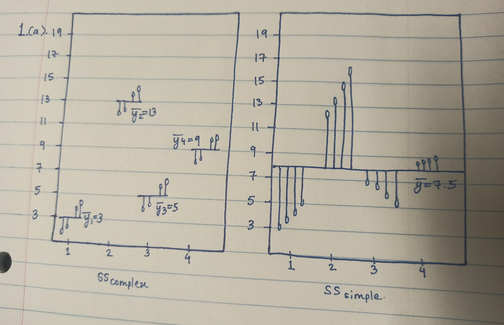
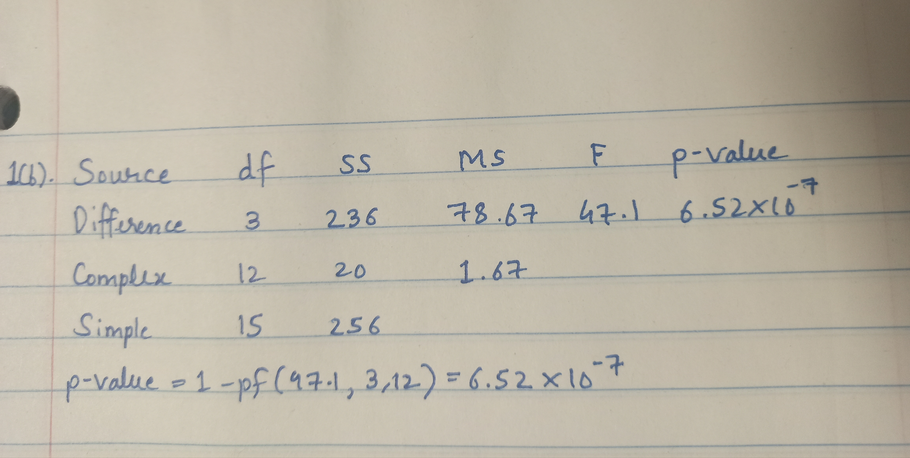
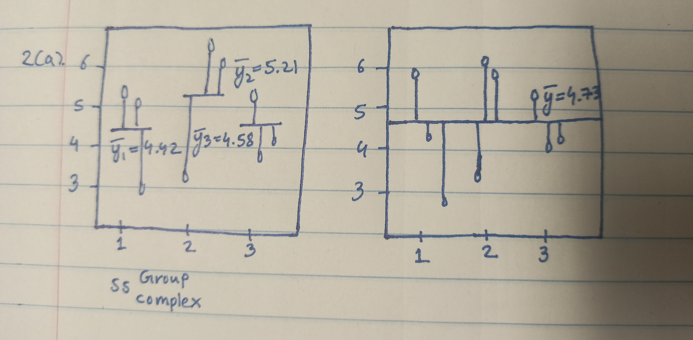
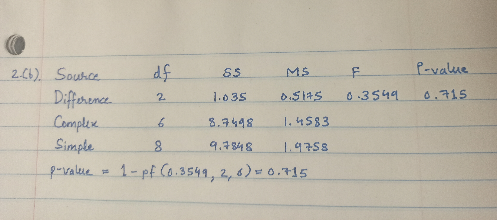
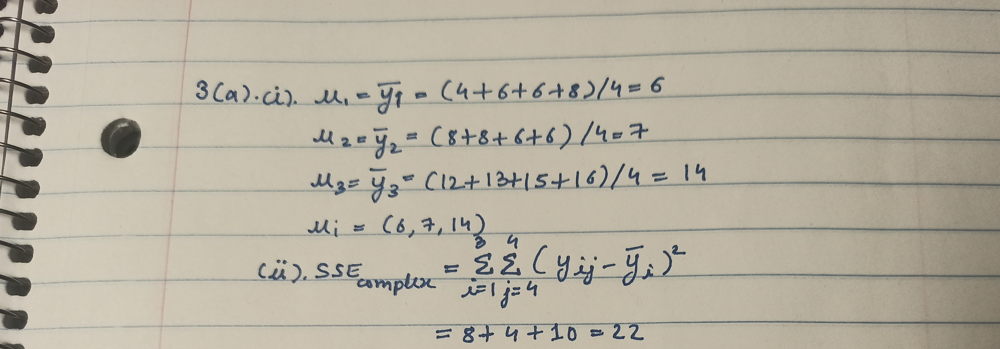
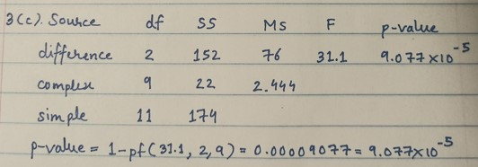

```{r, message = FALSE, warning = FALSE, echo = FALSE}
suppressPackageStartupMessages({
  library(boot)
  library(knitr)
  library(dplyr)
  library(tidyr)
  library(mosaic)
  library(ggplot2)
  library(latex2exp)
  library(tidyverse)
})
```

# Help

# Exercise 1

## 1a



\textbf{GOT IT}

\newpage

## 1b



\textbf{GOT IT}

\newpage

# Exercise 2

## 2a



\textbf{GOT IT}

\newpage

## 2b



\textbf{GOT IT}

\newpage

# Exercise 3

## 3a



\textbf{GOT IT}

## 3b


\textbf{GOT IT}

## 3c



\textbf{GOT IT}

# Exercise 4

```{r}

```

\textbf{GOT IT}

# Exercise 5

## 5a

```{r}

```

\textbf{GOT IT}

## 5b

```{r}

```

\textbf{GOT IT}

## 5c

```{r}

```

\textbf{GOT IT}

## 5d

```{r}

```

\textbf{GOT IT}

# Exercise 6

## 6(a)

```{r}
ggplot(iris, aes(x = Species, y = Sepal.Width)) + geom_boxplot()
```

Nope, no assumptions necessary for ANOVA appear to be violated here.
 
## 6(b)

```{r}
```

## 6(c)

```{r}
```


## 6(d)

```{r}
Prob6Model <- lm(Sepal.Width ~ Species, data = iris)
anova(Prob6Model)
```

We can see the p-value is 2.2e-16.

## 6(e)

```{r}
emmeans::emmeans(Prob6Model, pairwise ~ Species)
```

We can see the three p-values in the picture above.
